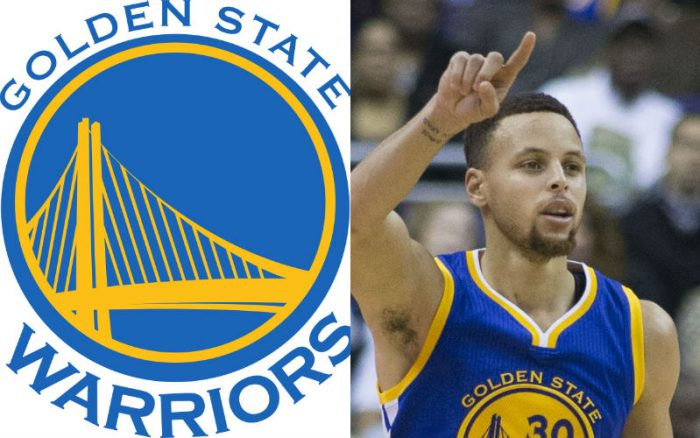
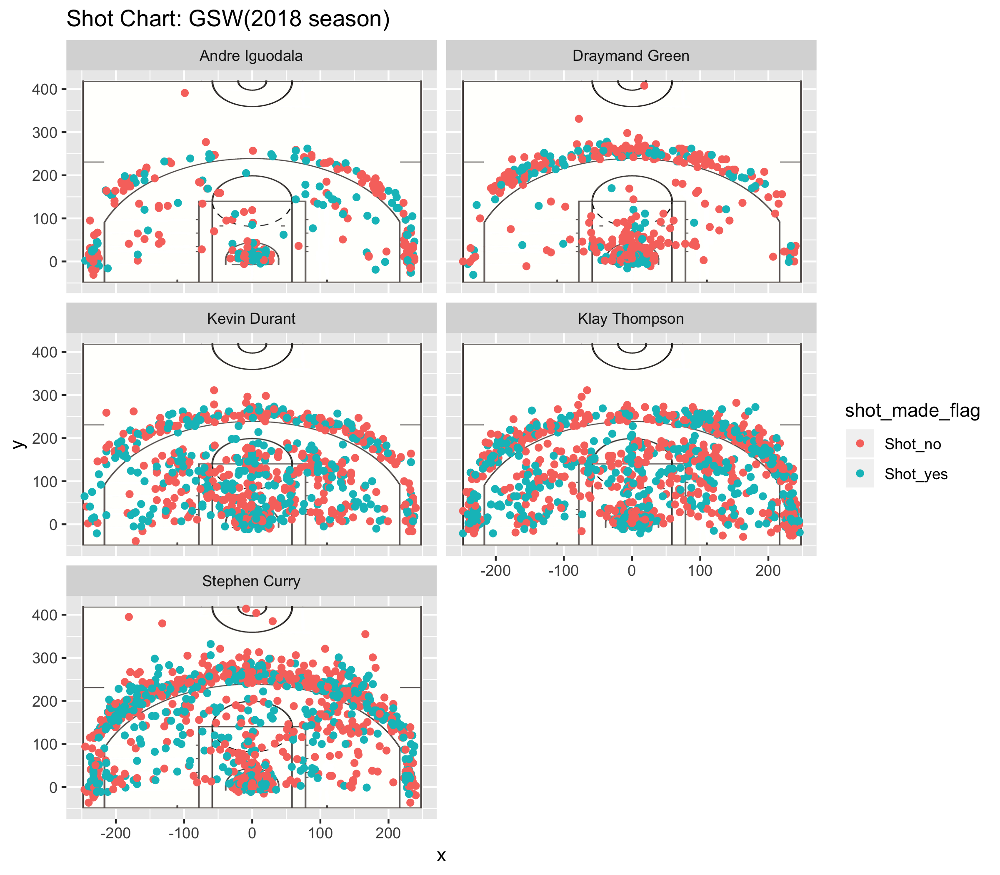

WorkOut01 - report
================
Boris Yung

*How Kevin Durant's(Golden State Warriors) performance during the 2018 season? *
================================================================================

    ## Warning: package 'dplyr' was built under R version 3.5.2

    ## Warning: package 'kableExtra' was built under R version 3.5.2

One of the biggest stars in the NBA, **Kevin Durant**, had decided to join the Golden State Warriors in the 2017-2018 season to go after the champion title that many Hall of Fame basketball player have. He will definitely become one of the Hall of Famer in the NBA because he is such a great and effective offensive player which allow him to win a seasonal MVP title before. And yet, because he is such a great attacker, he needs the ball most of the time which able him move with the ball and attack the basket (He is less likely to move without the ball). And don't forget, during that time, Warriors had already had three other All-stars player in the team as well; it included **Stephen Curry**, **Klay Thompson** and **Graymand Green** (which I don't really agree with). **Stephen Curry** is the team's point guard and one of the best 3-pt shooters in the league. He is famous for his unlimited shot range and the quick release of his shots. **Klay Thompson** is the team's shooting guards and an elite overall player. He can player both defend and offend position and also an accurate 3-points shooters as well. Both of them did also need to move with the ball in order to attack the basket (Although Curry always catch and shots as well as making pull up jumping right after some dribble move that he used to create some space between him and the defender). Hence, will **Kevin Durant** able to maintain his efficiency when he is with the **Golden State Warriors Team** since the team have already packed with talented NBA players?

To answer my question, the easiest way is to compare their shooting efficiency of 2018 NBA season among the Golden State Warriors' players. But first, I would love to show you guys the shooting chart of five players; ***Stephen Curry***, ***Klay Thompson***, ***Kevin Durant***, \*\*\* Andre Iguodala\*\*\* and ***Graymand Green*** in 2018 NBA season. Hence it can allow us to understand how's the team work on offense and who is the one who most likely to execute different possession.

From these charts, we can see that both Stephen Curry and Klay Thompson had taken a lot of shots. Because they are the shooters in the team (The Splash Brother), so it is typical that they take more shots than others because one of the main roles is scoring. Moreover, Kevin Durant did also take a lot of shots in 2017-2018 season as well. It is also natural because Kevin is famous for his ability to attack the basket, hence it's explained why he would have taken shots more than other players. For the player Andre Iguodala, his main role in the team are more likely to be the lock down defender; also, he is a below average shooters for outside range, but he has an amazing athleticism, therefore he is typical took fewer shots than Durant, Thompson and Curry. Draymand is an average shooter overall as well, but really not that good and 3pts range. Because he is physical and strong, most of his shots were made near the basket.

Next, we are going to see and study the efficiency tables of these 5 players in **2pts**, **3pts** and **overall pts**.

2pts efficiency table
---------------------

<table>
<thead>
<tr>
<th style="text-align:left;">
Name
</th>
<th style="text-align:right;">
total
</th>
<th style="text-align:right;">
made
</th>
<th style="text-align:right;">
perc\_made
</th>
</tr>
</thead>
<tbody>
<tr>
<td style="text-align:left;">
Andre Iguodala
</td>
<td style="text-align:right;">
210
</td>
<td style="text-align:right;">
134
</td>
<td style="text-align:right;">
63.80952
</td>
</tr>
<tr>
<td style="text-align:left;">
Kevin Durant
</td>
<td style="text-align:right;">
643
</td>
<td style="text-align:right;">
390
</td>
<td style="text-align:right;">
60.65319
</td>
</tr>
<tr>
<td style="text-align:left;">
Stephen Curry
</td>
<td style="text-align:right;">
563
</td>
<td style="text-align:right;">
304
</td>
<td style="text-align:right;">
53.99645
</td>
</tr>
<tr>
<td style="text-align:left;">
Klay Thompson
</td>
<td style="text-align:right;">
640
</td>
<td style="text-align:right;">
329
</td>
<td style="text-align:right;">
51.40625
</td>
</tr>
<tr>
<td style="text-align:left;">
Draymand Green
</td>
<td style="text-align:right;">
346
</td>
<td style="text-align:right;">
171
</td>
<td style="text-align:right;">
49.42197
</td>
</tr>
</tbody>
</table>
According to this 2pts effective shooting (in percentage) table, we can see that Andre Iguodala have the highest percentage (64%) of made shot amount all of the five players. It is because we all know that Andre Iguodala is a below average shooter from outside range, therefore, his shooting selection are more likely to be closer to the basket. On the other hand, Kevin Durant has about 61% of made shot in typically 2-pt range according to the table. Hence, we know that Kevin Durant did maintain his efficiency in 2-pts range as a excellent offensive player as before.

3pts efficiency table
---------------------

<table>
<thead>
<tr>
<th style="text-align:left;">
Name
</th>
<th style="text-align:right;">
total
</th>
<th style="text-align:right;">
made
</th>
<th style="text-align:right;">
perc\_made
</th>
</tr>
</thead>
<tbody>
<tr>
<td style="text-align:left;">
Klay Thompson
</td>
<td style="text-align:right;">
580
</td>
<td style="text-align:right;">
246
</td>
<td style="text-align:right;">
42.41379
</td>
</tr>
<tr>
<td style="text-align:left;">
Stephen Curry
</td>
<td style="text-align:right;">
687
</td>
<td style="text-align:right;">
280
</td>
<td style="text-align:right;">
40.75691
</td>
</tr>
<tr>
<td style="text-align:left;">
Kevin Durant
</td>
<td style="text-align:right;">
272
</td>
<td style="text-align:right;">
105
</td>
<td style="text-align:right;">
38.60294
</td>
</tr>
<tr>
<td style="text-align:left;">
Andre Iguodala
</td>
<td style="text-align:right;">
161
</td>
<td style="text-align:right;">
58
</td>
<td style="text-align:right;">
36.02484
</td>
</tr>
<tr>
<td style="text-align:left;">
Draymand Green
</td>
<td style="text-align:right;">
232
</td>
<td style="text-align:right;">
74
</td>
<td style="text-align:right;">
31.89655
</td>
</tr>
</tbody>
</table>
According to the 3-pts effective shooting (in percentage) table, we can see that Klay Thompson have the highest 3pts percentage (43%) among five players. And Kevin Durant have about 39% in 3pts shooting which is slightly below Stephen Curry who is famous for his ability to shot 3pts and above average of 3pts shooting percentage among NBA players. With such data, we can notice that in 3pts range, Kevin Durant are still efficiency as an elite offensive player as before.

Total pts efficiency table
--------------------------

<table>
<thead>
<tr>
<th style="text-align:left;">
Name
</th>
<th style="text-align:right;">
total
</th>
<th style="text-align:right;">
made
</th>
<th style="text-align:right;">
perc\_made
</th>
</tr>
</thead>
<tbody>
<tr>
<td style="text-align:left;">
Kevin Durant
</td>
<td style="text-align:right;">
915
</td>
<td style="text-align:right;">
495
</td>
<td style="text-align:right;">
54.09836
</td>
</tr>
<tr>
<td style="text-align:left;">
Andre Iguodala
</td>
<td style="text-align:right;">
371
</td>
<td style="text-align:right;">
192
</td>
<td style="text-align:right;">
51.75202
</td>
</tr>
<tr>
<td style="text-align:left;">
Klay Thompson
</td>
<td style="text-align:right;">
1220
</td>
<td style="text-align:right;">
575
</td>
<td style="text-align:right;">
47.13115
</td>
</tr>
<tr>
<td style="text-align:left;">
Stephen Curry
</td>
<td style="text-align:right;">
1250
</td>
<td style="text-align:right;">
584
</td>
<td style="text-align:right;">
46.72000
</td>
</tr>
<tr>
<td style="text-align:left;">
Draymand Green
</td>
<td style="text-align:right;">
578
</td>
<td style="text-align:right;">
245
</td>
<td style="text-align:right;">
42.38754
</td>
</tr>
</tbody>
</table>
According to this table, we can see that among all five players, Kevin Durant is the most efficiency in total shot made (54%). Compare to Stephen Curry (47%) who taken the most shots. We know that Kevin Durant had taken less shots than Stephen Curry did but made more than Curry did in the 2017-2018 NBA season. It indicates Kevin Durant is still an excellent offensive player that have high shot made percentage. Even Durant have switched to another team during off season and the team is full of talented players, he is still able to maintain his high efficiency performance and bring an positive impact to the team which allow them to won the NBA title in 2017-2018 season.

Take Home Message
-----------------

According to these tables, although **Kevin Durant** didn't have the most efficiency percentage in 2pts and 3pts but we can see that Kevin have the highest efficiency percentage among other players in Golden State Warriors in the overall pts table. Moreover, according to the shot data chart, he had not taken as much shots as Stephen Curry and Klay Thompson but still able to become the highest percentage in overall pts made in Golden State Warriors. Hence, we can conclude that even Kevin Durant had decided to play in a high talented team, he is still able to maintain his high efficiency on offence and bring a positive impact for the Golden State Warriors Team and later won the NBA champion title in the same season. Therefore, we can noticed that going to such a team with packed of talented players have no effect or minimum effect on Kevin Durant's performance and allow him to bring a positive impact on the Golden State Warriors NBA team and won a NBA champion title with the team and **Yes**, Kevin Durant is still about to maintain his efficiency when he is in the Golden State Warriors Team in the NBA.
